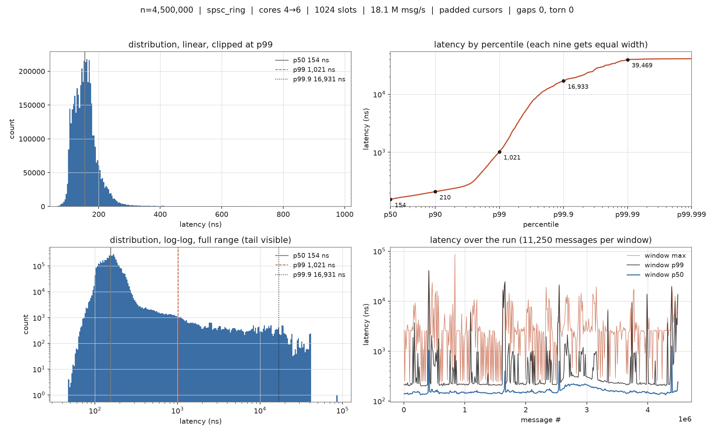

# mdbus

mdbus measures how long it takes to hand a small piece of data from one CPU core to
another, and more importantly, how much that time varies from message to message. It is
written as a simplified market data bus, which is the part of a trading system that
takes price updates arriving from an exchange and distributes them to the strategy
threads that act on them.

## Why the variation matters more than the average

If a system delivers a price update in 150 nanoseconds on a normal day but occasionally
takes 200 microseconds, the average still looks excellent and the system is still
broken. The slow deliveries are not spread evenly. They cluster around the moments when
the exchange is sending the most data, which are the same moments when prices are
actually moving, so the times you are slowest are the times being slow costs the most
money.

That is why almost everything here is reported as percentiles rather than as an average.
The p99.9 figure is the latency that only one message in a thousand exceeds, and p99.99
is one in ten thousand. At the message rates a real feed produces, one in ten thousand
happens several times a second. Those numbers are the ones worth arguing about, and
making them small and predictable is harder than making the average small.

## What is actually built

A lock-free ring buffer that carries fixed-size 64 byte messages from a producer thread
on one core to a consumer thread on another, a timing layer accurate enough to measure
something that takes about 150 nanoseconds, and a benchmark that runs several million
messages through it and reports the distribution.

"Lock-free" here means the two threads coordinate through atomic variables rather than
by taking a mutex. Neither thread can ever be blocked waiting for the other to release
something, which matters because a thread that holds a lock and then gets descheduled by
the operating system will stall the other thread for as long as it takes the scheduler
to run it again, potentially milliseconds.

Five million messages from core 4 to core 6 through a 1024 slot ring, on an Intel
i7-13700H running Arch Linux. Every message arrived exactly once, in order, with its
contents intact.



| | |
|---|---|
| fastest observed | 41.8 ns |
| median (p50) | 154.2 ns |
| p90 | 209.7 ns |
| p99 | 1.0 µs |
| p99.9 | 16.9 µs |
| slowest observed | 87.0 µs |
| throughput | 18.1 M messages/s (1156 MB/s) |

The left two panels of the figure show the same distribution twice, once zoomed into the
body and once on logarithmic axes so the long tail is visible. The top right panel plots
latency against percentile with the axis stretched so that each additional nine gets the
same width, which is the only way to see the shape of a tail without it collapsing into
the last few pixels. The bottom right panel splits the run into windows and plots the
median, the 99th percentile and the maximum of each window, so you can see that the
median stays flat for the whole run while the slow messages arrive in bursts.

### Reading those numbers honestly

The median is a real measurement of what the ring costs. The tail is mostly not the
ring, and I would rather explain that than quote it as though it were.

There are two separate causes, and the larger one is queueing. This benchmark runs the
producer as fast as it possibly can, so it outruns the consumer and the ring fills up,
and once the ring is full every new message has to wait for the 1024 messages ahead of
it to be processed before it is even looked at. At roughly 50 nanoseconds each that is about 50 microseconds
of delay available inside the buffer, which is the right size to explain most of what
the tail shows. This is a property of pushing the system to saturation, not a property
of the transport.

The other cause is the operating system, since nothing on this machine is isolated from
the normal work a desktop does. The kernel's timer interrupt fires on the benchmark's
cores, other processes get scheduled, and power management adjusts clock speeds while
the measurement is running, all of which show up as the spikes in the bottom right
panel.

Both are addressable and both are things I have not done yet, so the honest summary is
that the median and the throughput are trustworthy, and the tail should be read as an
upper bound on what the ring costs rather than as a measurement of it.

## Running it

Needs a Linux machine with an x86-64 CPU, a compiler with C++20 support, and CMake.

```bash
cmake -B build -DCMAKE_BUILD_TYPE=Release
cmake --build build -j
ctest --test-dir build --output-on-failure
```

The tests check the ring's behaviour at its boundaries, that two million messages
survive a trip between two threads without loss or corruption, and that the timing layer
agrees with the operating system's clock. One of them is a second build of the ring test
compiled with ThreadSanitizer, a tool that instruments memory accesses at runtime and
reports when two threads touch the same location without proper synchronisation between
them. That one is the test that actually verifies the concurrency claims rather than
just failing to catch a problem.

To reproduce the figure:

```bash
./build/spsc_latency --messages 5000000 --out results/spsc_padded
pip install -r plots/requirements.txt
python plots/plot_run.py results/spsc_padded
```

Alongside the raw samples, each run writes a small JSON file recording the configuration
and the state of the machine it ran on: the measured clock frequency, whether the CPU's
timestamp counter is reliable, whether a hypervisor was present, which cores were used.
A benchmark cannot force the machine into a good state, but it can make sure a result
never gets separated from the conditions that produced it.

## Background: why moving data between cores costs anything

A CPU core cannot read main memory quickly. Fetching from RAM takes something like 80
nanoseconds, during which a 4 GHz core could have executed a few hundred instructions.
So each core keeps recently used data in small fast caches attached to it, and those
caches do not store individual bytes. They store fixed 64 byte blocks called cache
lines, which is why a lot of this code is concerned with what fits in 64 bytes and what
crosses a boundary.

Each core has its own private cache, so the same cache line can exist in several cores
at once. The hardware keeps those copies consistent with a protocol whose basic rule is
that a line can be held for reading by many cores or for writing by exactly one, never
both. When a core wants to write to a line another core is holding, the other copy must
be invalidated first, and when that second core next reads the address it has to fetch
the line again from wherever the current version lives.

That fetch is the fundamental cost being measured here. It is not a software cost and no
amount of clever code removes it. It is roughly 40 to 80 nanoseconds of physical signal
travel between two caches on the same chip, and the numbers above are essentially that
cost plus the bookkeeping around it.

## How the ring works

The ring holds a fixed number of message slots and two counters. One counter records how
many messages have ever been pushed, the other how many have ever been popped. Neither
one wraps back to zero, and everything else follows from them: the number of messages
waiting is the difference between the two, the ring is empty when they are equal, and it
is full when they differ by the number of slots.

Storing running totals rather than positions within the array is what makes empty and
full distinguishable. If the counters were array positions that wrapped around, then the
two being equal would mean either that the ring is empty or that it is completely full,
with no way to tell which. The usual workarounds are to leave one slot permanently
unused or to keep a separate count that then needs synchronising itself, and running
totals avoid both. A 64 bit counter incrementing a billion times a second takes about
584 years to overflow, so the fact that it grows forever does not matter.

The slot a message goes into is found by taking the counter and keeping only its low
bits, which works because the number of slots is a power of two. This replaces a
division, which costs something like 20 to 40 cycles on x86 and does not pipeline well,
with a single bitwise AND. A compile-time assertion enforces the power-of-two
requirement, since the shortcut is only valid if it holds.

### Why the ordering of the writes has to be spelled out

The producer writes a message into a slot and then increments its counter to announce
that the slot is ready. The consumer waits until the counter says a message is there and
then reads the slot. That sounds like it obviously works, and on its own it does not.

Modern compilers and modern processors are both allowed to reorder operations that look
independent of each other, and writing to a slot and incrementing a counter are writes
to two different addresses. If they get reordered, the counter announces that a message
is ready before the message has actually been written, and the consumer reads whatever
happened to be in the slot.

C++ provides vocabulary for exactly this problem in the form of ordering annotations on
atomic operations. A store marked `release` guarantees that everything written before it
becomes visible to any thread that reads that value with a matching `acquire` load, and
neither the compiler nor the processor may move earlier writes past it. The two halves only work as a pair, so a release with no matching acquire guarantees
nothing at all.

In this ring the rule ends up being symmetric and easy to remember. Each thread reads
its own counter with relaxed ordering because it is the only writer of that counter and
does not need to synchronise with itself, reads the other thread's counter with acquire,
and writes its own with release. The less obvious of the two acquire loads is on the
producer's side, where it guarantees that the consumer has finished copying a slot out
before the producer is allowed to overwrite it.

There are no compare-and-swap operations anywhere in the ring. Because there is exactly
one writer for each counter, an ordinary load followed by an ordinary store is enough,
and avoiding the read-modify-write cycle that a general purpose queue needs is most of
why this design is fast. The cost of that is a restriction: exactly one thread may push
and exactly one may pop. That restriction is documented at the top of the header and
deliberately not enforced at runtime, because enforcing it would cost the thing it buys.

## How the timing works

Measuring something that takes 150 nanoseconds with a clock that takes 25 nanoseconds to
read is a problem, so the timing layer was built and characterised before anything was
measured with it.

Every x86 processor has a counter that increments at a fixed rate and can be read with a
single instruction, without calling into the operating system. Reading it directly is
several times cheaper than `std::chrono`, which goes through a layer of kernel-provided
code that reads the same counter and then converts it into nanoseconds. Doing that
conversion once per sample during the run is wasted work, so the benchmark records raw
counter values and converts the whole array afterwards.

Reading it correctly takes some care, because processors execute instructions out of
order and nothing in the source ordering stops the work being measured from starting
before the first timestamp is taken or finishing after the second. Getting a real stopwatch requires a variant of the read
instruction that waits for previously issued instructions to complete, followed by a
fence that stops later instructions being hoisted above it. The code provides both an
ordered read for measuring intervals and a cheaper unordered one for places where a few
nanoseconds of slop does not matter.

Measured on this machine:

| | |
|---|---|
| ordered read (`rdtscp` plus a fence) | 11.0 ns |
| unordered read (bare `rdtsc`) | 5.5 ns |
| `std::chrono::steady_clock::now()` | 20 to 25 ns |

The counter's rate is measured at startup by running it against the operating system's
clock for a tenth of a second, rather than trusting the value the kernel prints at boot.
The two agree to about 13 parts per million. The code also asks the CPU directly whether
its counter is of the type that ticks at a constant rate regardless of how fast the core
is currently running, because on older processors it counted actual core cycles, which
makes it useless as a clock. If that check fails the tests fail, on the principle that a
benchmark which silently reports wrong numbers is worse than one that refuses to run.

## The machine, and what is not controlled

The processor is an Intel i7-13700H, which is a hybrid design with two different kinds
of core on the same chip. Six of them are large cores running at up to 5.0 GHz, each of
which presents itself to the operating system as two logical CPUs sharing one set of
execution units. The other eight are smaller, simpler cores running at up to 3.7 GHz
with one logical CPU each.

```
CPU:   0  1  |  2  3  |  4  5  |  6  7  |  8  9  | 10 11 | 12 .. 19
       large   large    large    large    large   large    small
       4.8GHz  4.8GHz   5.0GHz   5.0GHz   4.8GHz  4.8GHz   3.7GHz
```

This matters more than it sounds like it should. The same timing instruction sequence
takes 11.0 ns on a large core and 19.2 ns on a small one, and the clock speed difference
only explains part of that, since the two core types are genuinely different designs
that happen to run the same instructions. Left to itself the operating system will
schedule a short-lived benchmark process onto a small core, so the default placement is
the wrong one and the benchmark pins its threads explicitly.

The two logical CPUs belonging to one large core share their L1 and L2 caches, so a
message passing between threads on those two never leaves the core and produces a
flattering number that no real deployment would see. The benchmark therefore uses one
logical CPU per physical core, and the pinning call checks its return value, which is
worth mentioning only because the function reports failure differently from most of the
POSIX API and testing it the usual way silently succeeds every time.

Several things are deliberately left uncontrolled for now. The cores are not isolated
from the rest of the system, so ordinary kernel and userspace work still gets scheduled
on them, simultaneous multithreading is still enabled, and although the CPU governor is
set to performance the clock speed still moves around within that. Together these are
why the tail is noisy, and dealing with them is the next piece of work rather than
something already finished.

## Things that turned out differently than expected

**Putting two hot variables on separate cache lines is not automatically an
improvement.** The standard advice for two atomic variables written by different threads
is to pad them so they land on different cache lines, avoiding a situation where writing
one invalidates the other for no reason. Applied to the original two-thread ping-pong
this code grew out of, it made the fastest observed round trip about three times worse.
The reason is that in a strict ping-pong the two threads take turns and never touch the
memory at the same time, so there was no interference to remove, and splitting four
slots that had comfortably shared one cache line across eight separate ones just meant
more lines had to move. The problem the padding is meant to solve only exists when two
threads are making progress at the same time.

**The compiler will quietly delete a benchmark that does not use its results.** An early
version of the consumer read a message out of a slot, compared its sequence number, and
did nothing with the answer. The generated machine code for the entire loop was two
instructions that checked the shutdown flag, with the read removed completely.
ThreadSanitizer reported no problems, which was accurate and useless, because there was
no longer any code left to have a problem.

**Padding the ring's own counters shows no measurable difference yet.** Three runs each
way and the ranges overlap completely. The likely explanation is that the current
implementation reads the other thread's counter on every single operation, so both cache
lines move between the cores constantly regardless of how they are laid out, and padding
can only start to pay once each side can usually proceed without looking. Testing that
means adding the optimisation where each thread caches its view of the other's counter
and only refreshes it when it appears to be out of room. Until that is done the honest
answer is that the expected effect is not visible.

**When a transport cannot keep up, latency does not degrade gently.** Running the same
workload through a conventional queue protected by a mutex costs roughly five times more
per message, which is unsurprising. The more interesting consequence is what it does to
delivery time. Because it cannot drain messages as fast as they arrive, its queue sits
permanently full and every message waits behind a full buffer, which moved the median
from around 120 nanoseconds to around 196 microseconds. Almost none of that is the cost
of locking. It is the backlog, and it is the failure mode that matters in practice,
because the moment a feed handler falls behind is a burst, and a burst is when being
late is expensive.

## Two axes, measured separately

The ping-pong this project grew out of is still in `legacy/`, and it turned out
to be a good vehicle for separating two questions that are easy to conflate:
how much of the latency is the code, and how much is the machine it runs on.

Seven variants of the same protocol were run in one process under identical
conditions, with the variant order shuffled between repetitions so a warming
machine could not be mistaken for a faster variant. Then the whole set was run
again with the two cores isolated at runtime.

| | p50 | p99 | p99.9 |
|---|---|---|---|
| original code, ordinary machine | 190 ns | 355 ns | 2511 ns |
| tuned code, ordinary machine | 112 ns | 180 ns | 2384 ns |
| original code, isolated cores | 95 ns | 165 ns | 496 ns |
| tuned code, isolated cores | **90 ns** | **101 ns** | **347 ns** |

Read down the two middle rows and the split is clean. Code changes moved the
body a long way and the tail not at all: every variant, including the original,
landed between 2383 and 2511 ns at p99.9 on an ordinary machine. Isolation
moved the tail by a factor of five to eight and the body comparatively little.
They are close to orthogonal, and neither substitutes for the other.

What the code changes were, in order of contribution: replacing the default
sequentially consistent atomics with release and acquire, which on x86 turns a
locked exchange into a plain store; hoisting a redundant load out of the
consumer's spin loop, since the value it re-read every iteration was one only
that thread could write; and storing each latency sample with a non-temporal
write so the three megabytes of results streaming past do not evict the ring's
cache line. Two things that did nothing: forcing both rings into one aligned
struct, and reducing the ring to a single slot.

Notably `_mm_pause()`, which is the standard advice for a spin loop, measures
**39 ns** on this processor, roughly 190 cycles. Dropping one into a loop
waiting for an event that arrives in 100 ns would cost more than it saves. It
is there to be polite to a hyperthread sibling and to save power, and on a
dedicated core it is the wrong instruction.

The isolation is applied at runtime rather than through the kernel command
line, via `scripts/fix_env.sh`: a cgroup v2 cpuset partition in `isolated` mode
removes the cores from scheduler load balancing the way `isolcpus` does, every
movable interrupt is steered elsewhere, and the process runs at a real-time
priority. The benchmark cores had been absorbing over 400,000 interrupts each,
which is most likely what the 2400 ns floor was. The one piece with no runtime
equivalent is `nohz_full`, since the periodic scheduler tick needs a boot
parameter to stop.

## Where things live

```
include/bus/   the library, header only: timing, message layout, core pinning,
               the ring itself, and percentile calculation
bench/         the latency benchmark
tests/         correctness tests, including a ThreadSanitizer build
plots/         the plotting script
legacy/        the two-core ping-pong this started from
results/       generated figures and metadata
```

`DESIGN.md` has the fuller design document, including the parts not built yet.
